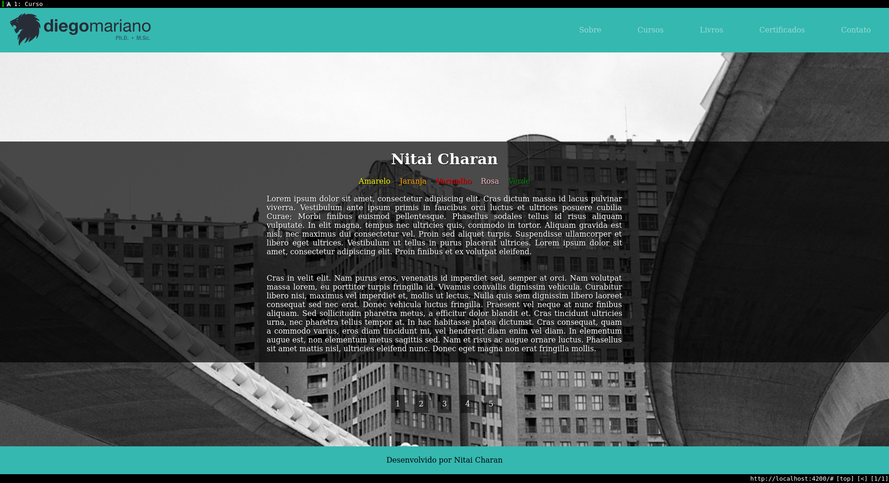

## Udemy-JSEJQPI
<!-- PROJECT SHIELDS -->
![Angular][angular-shield]
![TypeScript][typescript-shield]
![HTML5][html5-shield]
![CSS3][css3-shield]
![jQuery][jquery-shield]
![VIM][vim-shield]
![Udemy][udemy-shield]

Project available to access at: https://nitaicharan.github.io/Udemy-JSEJQPI/



## Deploy
```
ng build
index.html:base:"/" -> index.html:base:"/Udemy-JSEJQPI/"
cp dist/curso/index.html dist/curso/404.html

git add -A
git commit -m <titule> <message>
git push origin <branch>
git push --delete origin gh-pages
git subtree push --prefix dist/curso origin gh-pages
```

## About course
JavaScript e jQuery para Iniciantes
<br>Curso rápido para aprender sobre jQuery

URL: https://www.udemy.com/course/introducao-ao-jquery/

### Requirements
- HTML básico
- CSS básico
- JavaScript básico

### Description
jQuery é a mais popular biblioteca JavaScript. Ela permite o desenvolvimento de aplicações web potentes com poucas linhas de código, entretanto compreender jQuery envolve esforço. Segundo estatísticas, jQuery é usado em 3 a cada 4 dos websites mais visitados do mundo. Neste curso você aprenderá a construir suas primeiras aplicações usando jQuery.  Matricule-se já!

#### Who this course is for:
Programadores web

#### Diego Mariano, Ph.D.
Doutor, mestre e professor de ensino à distância
Diego Mariano é analista de sistemas, pesquisador e professor de cursos à distância em programação, banco de dados e bioinformática (alguns gratuitos).

Atualmente realiza estágio pós-doutoral no Departamento de Ciência da Computação da Universidade Federal de Minas Gerais. Cursa _Professional degree_ em Data Science pela Universidade de Harvard na plataforma online da edX. Possui ainda *mestrado e doutorado* em Bioinformática pela UFMG e bacharelado em Sistemas de Informação. Tem formação técnica em redes computacionais e profissionalizante em manutenção de computadores e design para impressão gráfica.

**English:** Diego Mariano is a systems analyst and instructor of online courses about Programming Languages, Database Management Systems, and Bioinformatics (some courses are free). He is a postdoctoral researcher at the Federal University of Minas Gerais and a Professional Degree student at HarvardX. Also, he has majored in Information Systems and he has a master's degree and a Ph.D. in Bioinformatics.

**Español:** Dr. Diego Mariano es analista de sistemas, investigador y docente de cursos en línea sobre lenguajes de programación, bases de datos y bioinformática (algunos cursos son gratuitos). Actualmente es post-doc de la Universidad Federal de Minas Gerais y estudiante de grado profesional en HarvardX. Además, se graduó en sistemas de información y tiene una maestría en bioinformática.

This project was generated with [Angular CLI](https://github.com/angular/angular-cli) version 8.3.13.

## Development server

Run `ng serve` for a dev server. Navigate to `http://localhost:4200/`. The app will automatically reload if you change any of the source files.

## Code scaffolding

Run `ng generate component component-name` to generate a new component. You can also use `ng generate directive|pipe|service|class|guard|interface|enum|module`.

## Build

Run `ng build` to build the project. The build artifacts will be stored in the `dist/` directory. Use the `--prod` flag for a production build.

## Running unit tests

Run `ng test` to execute the unit tests via [Karma](https://karma-runner.github.io).

## Running end-to-end tests

Run `ng e2e` to execute the end-to-end tests via [Protractor](http://www.protractortest.org/).

## Further help

To get more help on the Angular CLI use `ng help` or go check out the [Angular CLI README](https://github.com/angular/angular-cli/blob/master/README.md).

## Contact
[![Gmail][gmail-shield]][gmail-url]
[![LinkedIn][linkedin-shield]][linkedin-url]
[![Github][github-shield]][github-url]
[![Udemy][udemy-shield]][udemy-url]
[![Instagram][instagram-shield]][instagram-url]
[![Twitter][twitter-shield]][twitter-url]

<!-- MARKDOWN LINKS & IMAGES -->
<!-- https://www.markdownguide.org/basic-syntax/#reference-style-links -->

<!-- CONTACT SHIELDS -->
[linkedin-shield]: https://img.shields.io/badge/-LinkedIn-white.svg?logo=linkedin&colorB=0077B5&logoColor=white
[linkedin-url]: https://www.linkedin.com/in/nitaicharan/
[gmail-shield]: https://img.shields.io/badge/-Gmail-black.svg?logo=gmail&colorB=D14836&logoColor=white
[gmail-url]: mailto:niaicharan@gmail.com?subject=It%20comes%20from%20Github%20profile
[github-shield]: https://img.shields.io/badge/-Github-black.svg?logo=github&colorB=181717&logoColor=white
[github-url]: https://github.com/nitaicharan
[udemy-shield]: https://img.shields.io/badge/-Udemy-black.svg?logo=udemy&colorB=EC5252&logoColor=white
[udemy-url]: https://www.udemy.com/user/nitai-charan/
[instagram-shield]: https://img.shields.io/badge/-Instagram-black.svg?logo=instagram&colorB=EC5252&logoColor=white
[instagram-url]: https://www.instagram.com/nitaicharan/?hl=pt-br
[twitter-shield]: https://img.shields.io/badge/-Twitter-black.svg?logo=twitter&colorB=1DA1F2&logoColor=white
[twitter-url]: https://twitter.com/nitaicharan1
[facebook-shield]: https://img.shields.io/badge/-Facebook-black.svg?logo=facebook&colorB=4172B8&logoColor=white
[facebook-url]: https://www.facebook.com/NitaiCharan1

<!-- PROJECT SHIELDS -->
[html5-shield]: https://img.shields.io/badge/-HTML5-black.svg?logo=html5&colorB=E34F26&logoColor=white
[css3-shield]: https://img.shields.io/badge/-CSS3-black.svg?logo=css3&colorB=1572B6&logoColor=white
[sass-shield]: https://img.shields.io/badge/-SASS-black.svg?logo=sass&colorB=CC6699&logoColor=white
[angular-shield]: https://img.shields.io/badge/-Angular-black.svg?logo=angular&colorB=DD0031&logoColor=white
[vim-shield]: https://img.shields.io/badge/-Vim-black.svg?logo=vim&colorB=019733&logoColor=white
[java-shield]: https://img.shields.io/badge/-Java-black.svg?logoColor=white&logo=java&&colorB=007396
[javascript-shield]: https://img.shields.io/badge/-JavaScript-black.svg?logoColor=white&logo=javascript&&colorB=F7DF1E
[typescript-shield]: https://img.shields.io/badge/-TypeScript-black.svg?logoColor=white&logo=typescript&&colorB=007ACC
[react-shield]: https://img.shields.io/badge/-React-black.svg?logoColor=white&logo=react&colorB=61DAFB
[jquery-shield]: https://img.shields.io/badge/-jQuery-white.svg?logo=jquery&colorB=0769AD&logoColor=white

## License
Copyright &copy; Nitai Charan. All rights reserved.

Licensed under the [GNU General Public License v3.0](LICENSE) license.
